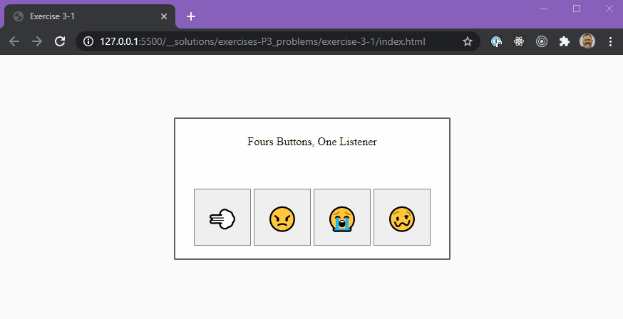
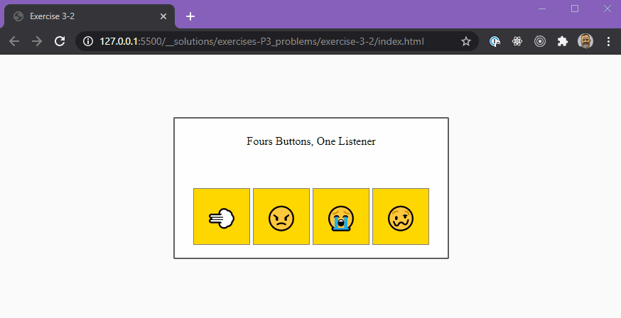
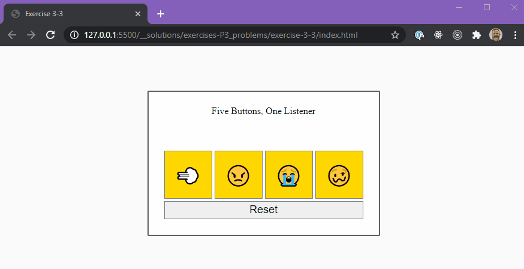
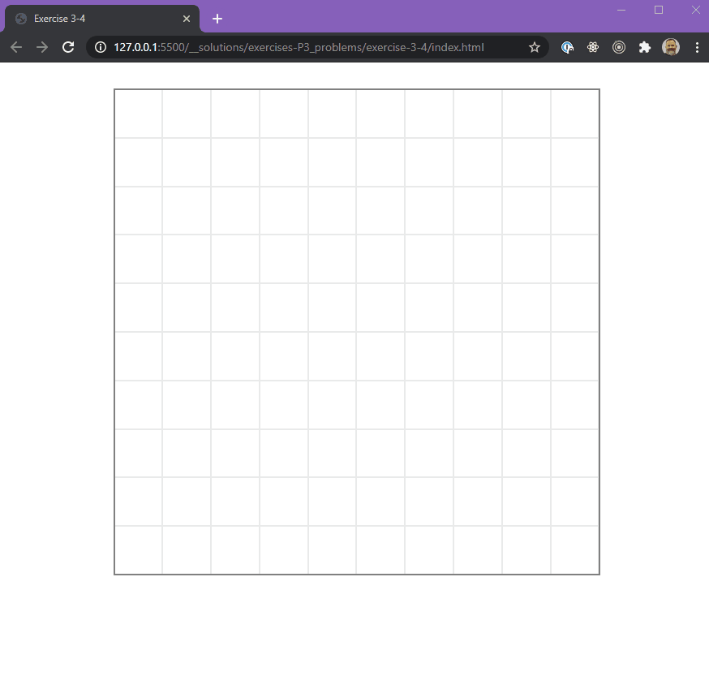
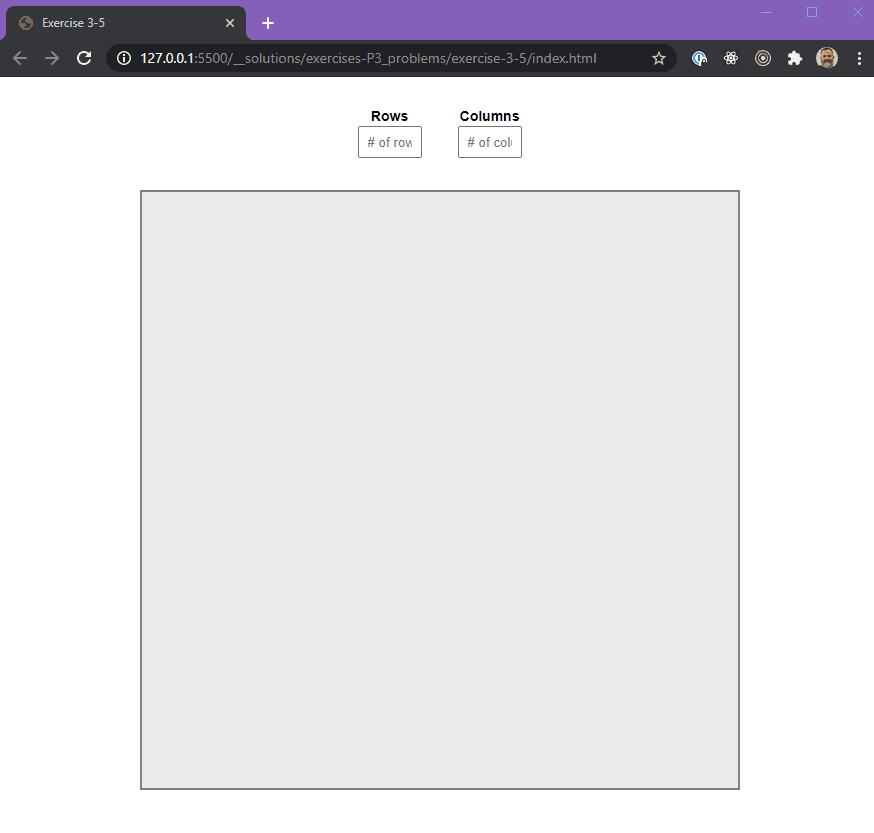

# Module 2-6 - More JavaScript Fundamentals P1

## Completion Requirements

|              | 75% Minimum | 100% Complete | Stretch      |
| ------------ | ----------- | ------------- | ------------ |
| Exercises P1 | exercise 1  |               |              |
| Exercises P2 | up to `2-7` | up to `2-10`  | up to `2-15` |
| Exercises P3 | up to `3-3` | up to `3-4`   | up to `3-5`  |

## Exercises P1 (1-1 to 1-4)

Short questions all related to given set of functions.

## Exercises P2 (2-1 to 2-15)

These exercises aim to introduce you to testing.

You can run the files in the debugger.

1. Open the terminal/Debug Console with `ctrl+j` (win) or `cmd+j` (mac).
2. Open the `js` file you want to debug.
3. Select the debugger icon from the sidebar.
4. Click the `Run and Debug` button.
5. Select the `Node.js` environment when promted.

The file will be executed and the output will be output to the debug console.

## Exercises P3 (3-1 to 3-5)

- You are only allowed to modify the `app.js` file, and perhaps the `index.html`.
- Look over the HTML file before beginning.
- The `app.js` file contains relevant hints.

### Exercise 3-1

There are 4 buttons that are supposed to do different things when clicked.

- button one disappears (initial opacity is `100`)
- button two turns 'crimson'
- button three turns 'lightblue'
- button four starts shaking... (animation provided in styles css as a class called `jitters`)

### Exercise 3-2

#### STEP 1

- Reimplement the functionality of `3-1` (Try to NOT look at your previous solution).

#### STEP 2

- This time the buttons should toggle.
- Meaning if the user clicks on them a second time, it should go back to initial state.
- Initial button color is `gold`.

### Exercise 3-3

#### STEP 1

- Reimplement the functionality of `3-1` and `3-2`

#### STEP 2

- There should be a RESET button that "resets" all of the buttons to their original state.

### Exercise 3-4 - The Grid

Create a game board. The CSS will, for the most part, take care of itself as long as you assign the right classes to the cells.

#### Objectives

- set the size of the board to a square of `600px`;
- set a number of cells per row;
- the cells should all be square.
- cells should have a class of `cell`
- cells should have and id of `cell-#`

### Exercise 3-5 - The Custom Grid (Stretch)

#### Objectives

- Use the grid code you wrote in 3-4
- Allow the user to create cells on the board based on values he/she inputs.
- Ask the user the number of `ROWS` and `COLUMNS`
- Use those values to generate a grid

